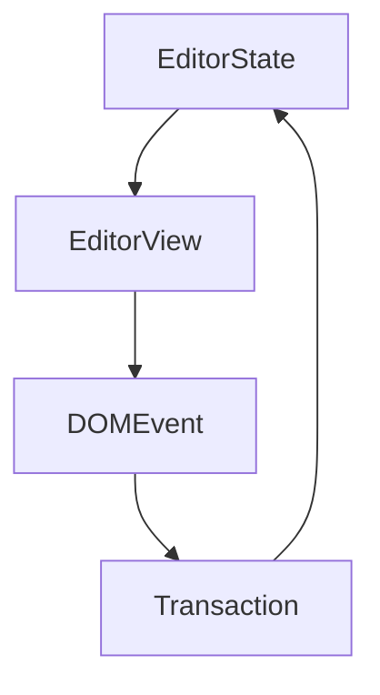

# Milkdown
 [↩](#user-content-fnref-1)
> Milkdown is a WYSIWYG markdown editor framework.
>
> 🍼 Here is the [repo](https://github.com/Milkdown/milkdown) (right click to open link).\
> We ~~only support commonmark~~. GFM is also supported!

You can check the output markdown text in **two columns editing**.

* Features

  * 📝 **WYSIWYG Markdown** - Write markdown in an elegant way

  * 🎨 **Themable** - Theme can be shared and used with npm packages

  * 🎮 **Hackable** - Support your awesome idea by plugin

  * 🦾 **Reliable** - Built on top of [prosemirror](https://prosemirror.net/) and [remark](https://github.com/remarkjs/remark)

  * ⚡ **Slash & Tooltip** - Write fast for everyone, driven by plugin

  * 🧮 **Math** - LaTeX math equations support, driven by plugin

  * 📊 **Table** - Table support with fluent ui, driven by plugin

  * 📰 **Diagram** - Diagram support with [mermaid](https://mermaid-js.github.io/mermaid/#/), driven by plugin

  * 🍻 **Collaborate** - Shared editing support with [yjs](https://docs.yjs.dev/), driven by plugin

  * 💾 **Clipboard** - Support copy and paste markdown, driven by plugin

  * 👍 **Emoji** - Support emoji shortcut and picker, driven by plugin

* Made by

  * Programmer: [Mirone](https://github.com/Milkdown)

  * Designer: [Mirone](https://github.com/Milkdown)

***

You can add `inline code` and code block:

```javascript
function main() {
  console.log('Hello milkdown!');
}
```

> Tips: use `<mod>+<enter>` to exit blocks such as code block.

***

You can type `|3x2|<space>` to create a table:

| First Header   | Second Header      |
| -------------- | ------------------ |
| Content Cell 1 | \`Content\` Cell 1 |
| Content Cell 2 | **Content** Cell 2 |

***

Math is supported by [TeX expression](https://en.wikipedia.org/wiki/TeX).

Now we have some inline math: $E = mc^2$. You can click to edit it.

Math block is also supported.

$$ \begin{aligned} T( (v\_1 + v\_2) \otimes w) &= T(v\_1 \otimes w) + T(v\_2 \otimes w) \ T( v \otimes (w\_1 + w\_2)) &= T(v \otimes w\_1) + T(v \otimes w\_2) \ T( (\alpha v) \otimes w ) &= T( \alpha ( v \otimes w) ) \ T( v \otimes (\alpha w) ) &= T( \alpha ( v \otimes w) ) \ \end{aligned} $$

You can type `$$<space>` to create a math block.

***

Use [emoji cheat sheet](https://www.webfx.com/tools/emoji-cheat-sheet/) such as `:+1:` to add emoji[1](#user-content-fn-1).

You may notice the emoji filter while inputting values, try to type \`:baby\` to see the list.

***

Diagrams is powered by [mermaid](https://mermaid-js.github.io/mermaid/#/).

You can type ` ```mermaid ` to add diagrams.



***

Have fun!

## Footnotes

1. We use [tweet emoji](https://twemoji.twitter.com) to make emoji can be viewed cross platforms.
